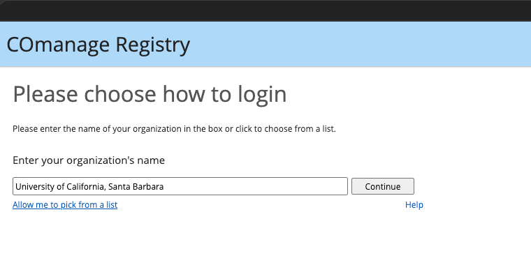
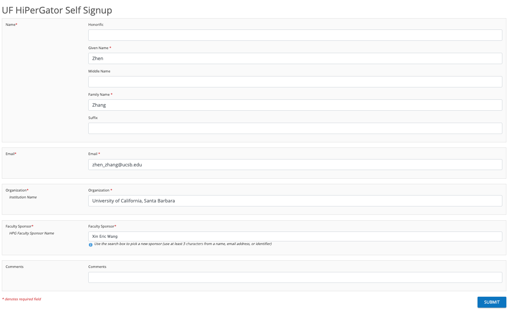
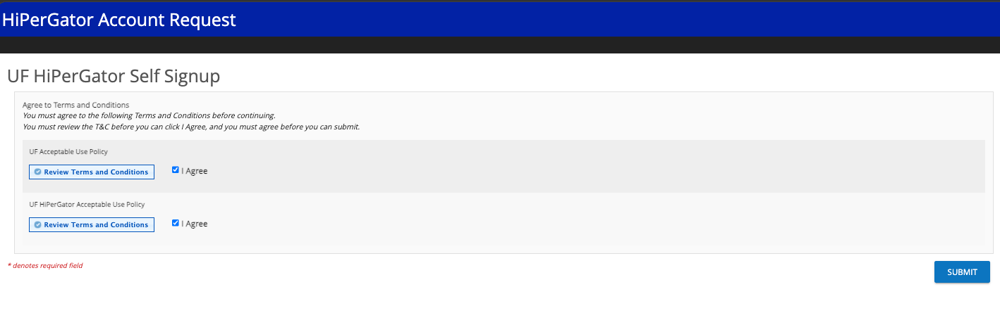
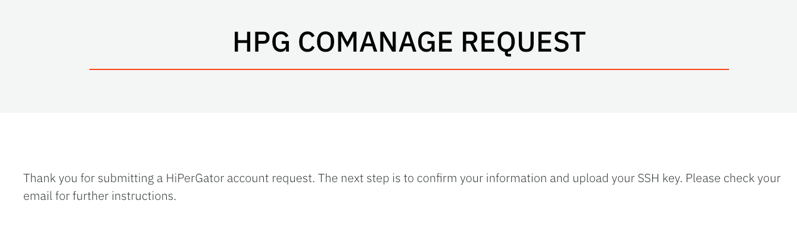
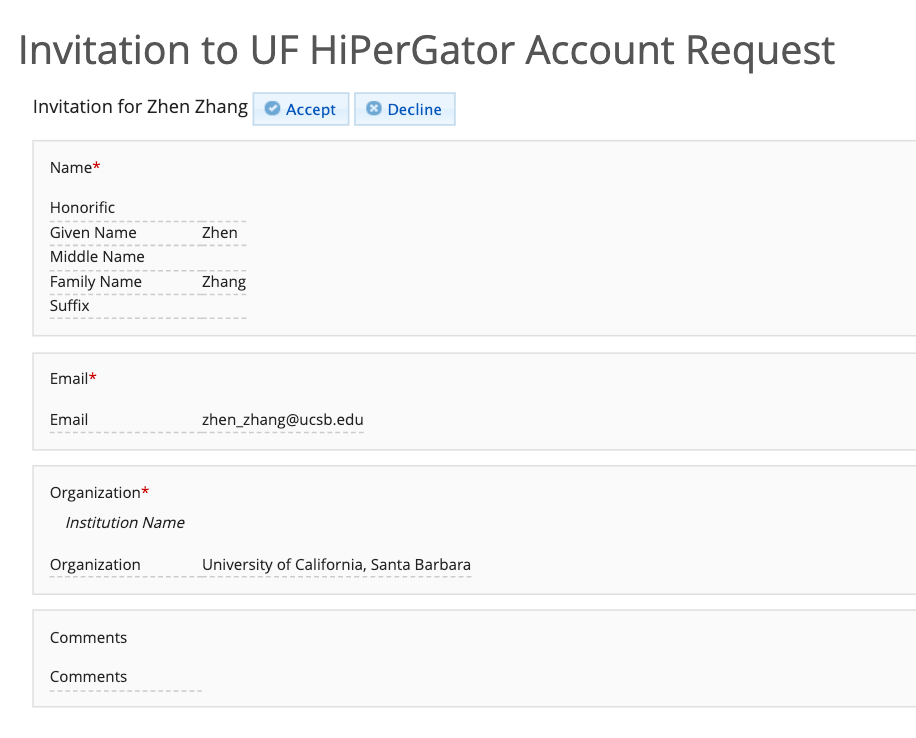
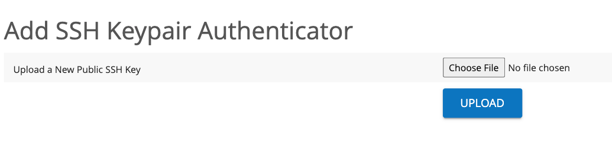
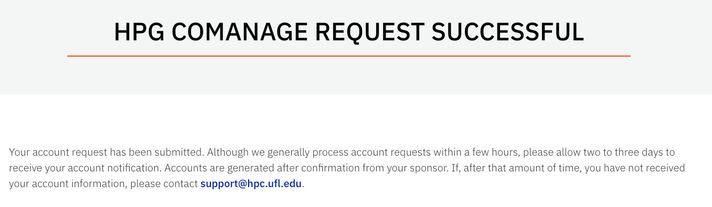

# Apply for a UF HiPerGator Account

This guide is for UCSB students and collaborators applying for a HiPerGator account under **Prof. Xin Eric Wang**. Follow the steps below to submit your request, confirm your email, and upload your public SSH key.

The screenshots show an example application. Enter **your own name and email address** wherever personal information is requested.

## Step 1 Choose UCSB and sign in

Open the [Federated Account Request Form](https://federation.it.ufl.edu/registry/co_petitions/start/coef:6).

Enter or select **University of California, Santa Barbara**, then click **Continue**. Complete the UCSB sign-in process when prompted.



## Step 2 Complete the application form

On the **UF HiPerGator Self Signup** page, fill in the fields as follows:

| Field | What to enter |
| --- | --- |
| Honorific | Optional; leave blank if not applicable |
| Given Name | Your first name |
| Middle Name | Your middle name, if applicable |
| Family Name | Your last name |
| Suffix | Optional; leave blank if not applicable |
| Email | Your own UCSB email address |
| Organization | `University of California, Santa Barbara` |
| Faculty Sponsor | Search for and select **Xin Eric Wang** |
| Comments | Optional; briefly describe your research or leave blank |

For **Faculty Sponsor**, use the search box to select the matching sponsor record. Review your information, then click **SUBMIT**.



## Step 3 Review and agree to the policies

The next page lists two policies:

1. **UF Acceptable Use Policy**
2. **UF HiPerGator Acceptable Use Policy**

Click **Review Terms and Conditions** for each policy. After reviewing them, check both **I Agree** boxes if you accept the terms, then click **SUBMIT**.



## Step 4 Check the submission confirmation

You should see the **HPG COMANAGE REQUEST** page. It confirms that your initial request was submitted and asks you to check your email to confirm your information and upload your SSH key.

**There are still email confirmation and key upload steps to complete.**



## Step 5 Open the confirmation email

Check the inbox for the email address you entered in the form. If the message is missing, check your spam or junk folder.

The email explains that you requested access to UF HiPerGator and includes a link to review your request and upload your public SSH key.

Click the invitation link in **your own email**. Each applicant receives an individual link.

## Step 6 Accept the invitation

The link opens **Invitation to UF HiPerGator Account Request**.

Check that your name, email, and organization are correct, then click **Accept**.



## Step 7 Upload your public SSH key

You will be taken to **Add SSH Keypair Authenticator**.

1. Click **Choose File**.
2. Select your **public SSH key** file, usually ending in `.pub`.
3. Click **UPLOAD**.

Upload only the public key, such as `id_ed25519.pub`. Keep the corresponding private key on your own computer.

If you do not have an SSH key pair yet, follow the [UF instructions for creating SSH keys](https://docs.rc.ufl.edu/access/ssh_keys/), then return to upload the public key.



## Step 8 Wait for sponsor approval and account creation

After uploading the key, you should see **HPG COMANAGE REQUEST SUCCESSFUL**.

Your submission is complete. The account will be created after confirmation from your sponsor. The confirmation page asks applicants to allow **two to three days** to receive their account notification.

Watch your email for the account creation message and your assigned HiPerGator username. If you have not received it after that period, follow the support instructions on the confirmation page.



The successful request page confirms submission. Wait for the separate account creation email before attempting to use your new account.

## Connect to HiPerGator with eduVPN

After your account has been created, follow these steps to connect through SSH. Federated users must connect to eduVPN first.

### Step 1 Download eduVPN

Visit the [official eduVPN download page](https://www.eduvpn.org/client-apps/) and install the app for your operating system:

- **macOS:** Click **Download for macOS** to install it from the App Store.
- **Windows:** Click **Download for Windows** and run the installer.
- **Linux:** Follow the installation instructions linked on the download page.

### Step 2 Select the University of Florida

Open eduVPN and search for **University of Florida**. Select the University of Florida HiPerGator entry to start the connection process.

At this step, select UF because you are connecting to the UF network.

### Step 3 Sign in with your UCSB account

A browser window will open for institutional authentication. Select **University of California, Santa Barbara**, then sign in with your own UCSB credentials and complete multi-factor authentication.

Use the institution associated with your HiPerGator account. If your existing account was created using a different institutional identity, use that institution instead.

### Step 4 Approve the connection

Approve the eduVPN access request in your browser. Return to the eduVPN app and confirm that the connection is active.

Keep eduVPN connected while accessing HiPerGator through SSH.

### Step 5 Connect through SSH

Open a terminal on your own computer and run:

```bash
ssh -i ~/.ssh/id_ed25519_ufhpg YOUR_HPG_USERNAME@hpg.rc.ufl.edu
```

Replace `YOUR_HPG_USERNAME` with the username in your account creation email. Replace `~/.ssh/id_ed25519_ufhpg` with the path to the private key corresponding to the public key you uploaded during registration.

If prompted for a key passphrase, enter the passphrase you chose when creating the key.

Reference: [UF HiPerGator Federated Login](https://docs.rc.ufl.edu/access/federated_login/).

## Optional Configure an SSH shortcut

Add the following entry to `~/.ssh/config` on your own computer. Keep any existing entries. If you already have a `Host hpg` entry, update it instead of adding a duplicate.

```sshconfig
Host hpg
    AddKeysToAgent yes
    IdentityFile ~/.ssh/id_rsa
    UseKeychain yes                   # macOS Only
    User YOUR_HPG_USERNAME
    HostName hpg.rc.ufl.edu
    ControlMaster auto
    ControlPath ~/.ssh/cm-%C
```

Customize these settings:

- **User:** Replace `YOUR_HPG_USERNAME` with the username from your account creation email.
- **IdentityFile:** Set the path to your private SSH key. For example, use `~/.ssh/id_ed25519_ufhpg` if that is the key you created. The `id_rsa` path above is only an example.
- **UseKeychain:** Keep this line on macOS. Remove it on Windows or Linux.

`AddKeysToAgent` adds a loaded key to a running SSH agent. `ControlMaster` and `ControlPath` enable connection sharing on supported SSH clients. If your client does not support connection sharing, omit those two lines.

Save the file, connect to eduVPN, then run:

```bash
ssh hpg
```

The name `hpg` is a shortcut defined in your local SSH configuration.
